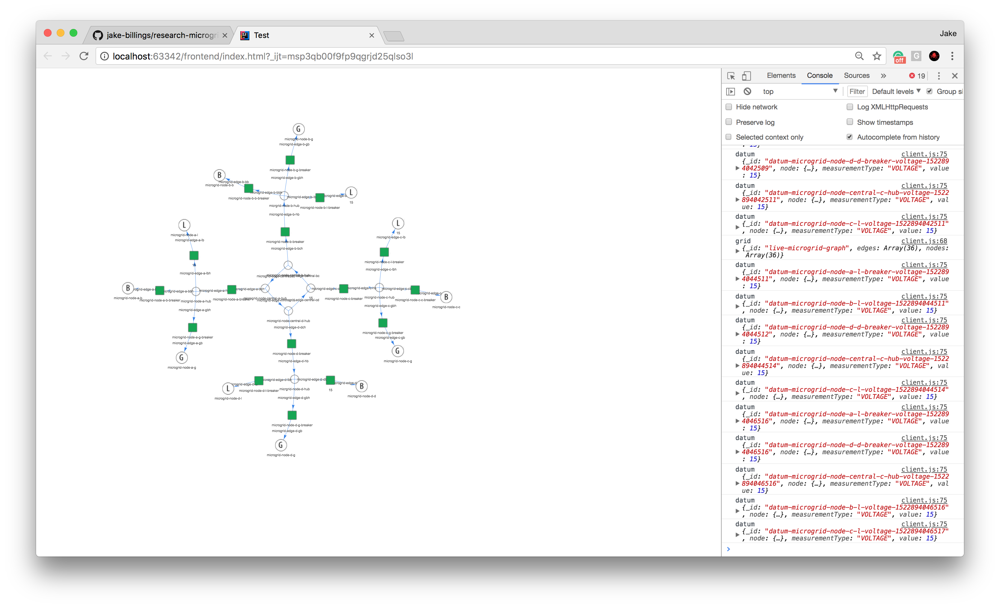
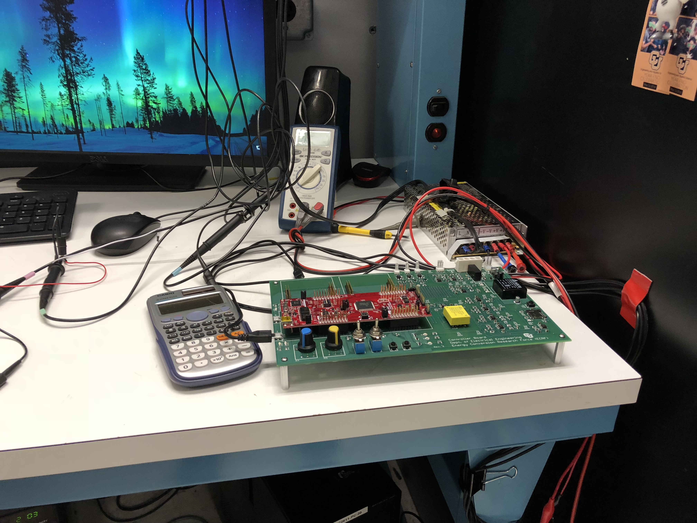
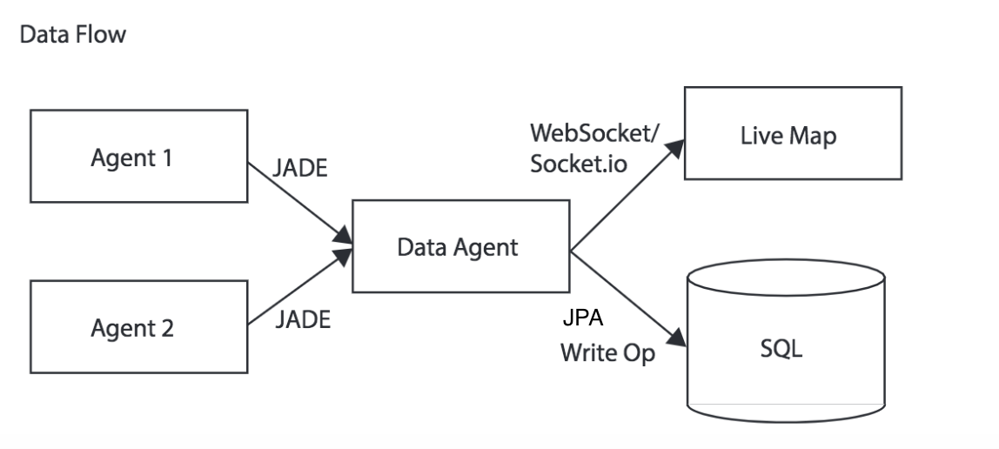
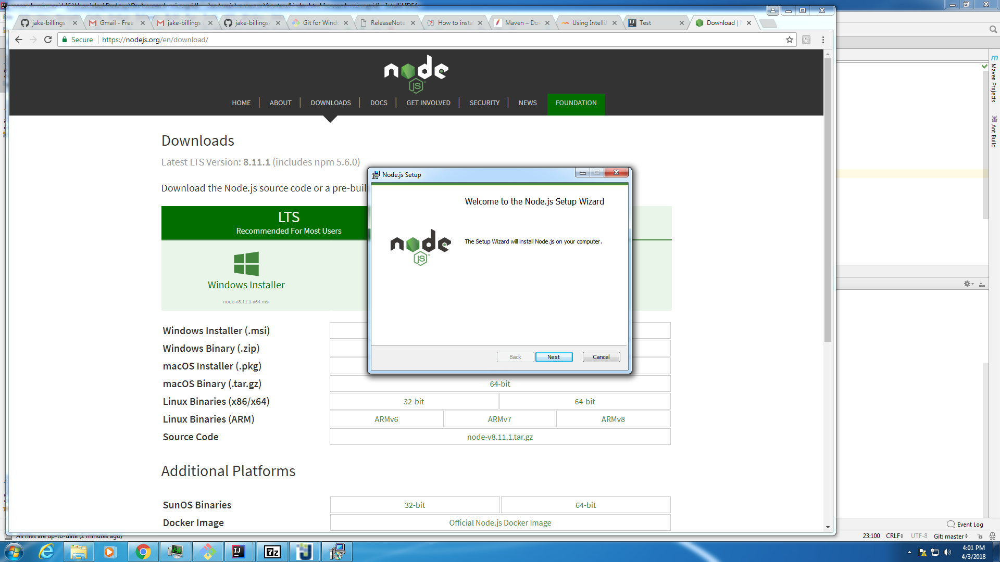
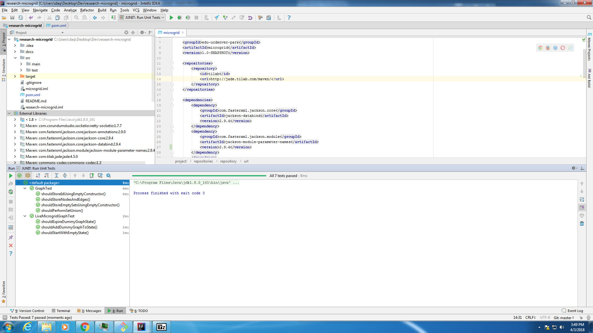
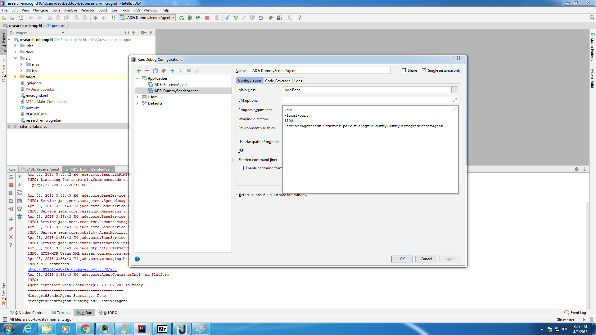

# research-microgrid

This repository contains code written for Dr. Park's microgrid research at University of Colorado Denver. The purpose is to implement a JADE agent that receives near real-time data from a distributed system of power-grid control/monitoring devices. It should store the data in SQL and send it to a GUI that maps the entire system.

I approached the problem as event-driven graph data. The power control/monitoring network is represented as a graph. The data is "pushed" to the "data agent" implemented in this repository by other agents.

Each data structure is abstracted in the "abs" package such that the code could theoretically be reused for an entirely different purpose. See `Graph` and `MicrogridGraph`.

## Architecture
### Data Flow
1. Measured by Sender Agent, which interfaces with control hardware

2. Sent via JADE to Receiver Agent
3. Sent from Receiver Agent to Frontend Client via Socket.io

See `docs/Spec.docx` for more documentation/explanation of the communication protocol. It is important to understand the architecture before working on this repository.

## Prerequisites
1. You will need Administrator-level access to a computer
1. You will need to have cloned this git repository using `git clone`
1. You will need to have IntelliJ (or be able to translate my instructions from IntelliJ to whatever you're using)
1. You will need JDK 1.8 (Not JDK <1.8. NOT JDK >=1.9. You need exactly JDK1.8 (See "Issues" section)

## Setup Javascript Frontend
1. Install NodeJS

1. Check that NodeJS is actually installed `node --version`,  `npm --version`
1. Using the NodeJS package manager, install a better package manager, called Yarn. `npm i -g yarn`
1. Verify Yarn is installed using `yarn -v`

1. Move into the frontend project directory using `cd src/main/resources/frontend`
1. Install the frontend dependencies using `yarn install`

## Setup JADE/Java
1. Resolve dependencies using maven (use IntelliJ to do this) `mvn install` might also work
1a. Open the Maven Toolkit Window

1b. Open the Maven project by pressing the plus icon the selecting the pom.xml file
1c. Run Maven install to install all of the Java dependencies (JADE, Jackson, netty-socketio, etc...)

1d. Run the JUnit tests using Maven to make sure everything installed properly. You should see 0 failures. However, if you see "Failures: n" where n is some number there is a code issue (not a dependency issue). If you don't get test results, then there's probably an issue resolving dependencies or with maven configuration that must be addressed.

2. Run JUnit Tests (again but using IntelliJ test runner instead of Maven)
2a. Open run configurations

2b. Create a new run configuration for the JUnit tests

2c. Using the new run configuration, run the JUnit tests to make sure all the tested code works.

3. Create run configurations for the JADE agents
3a. Open run configurations

3b. Create a run configuration for the receiver agent
`java jade.Boot -gui -local-port 1100 ReceiverAgent:MicrogridReceiverAgent`

3c. Create a run configuration for the dummy sender agent (for testing purposes)
`java jade.Boot -gui -local-port 1100 DummySenderAgent:edu.ucdenver.park.microgrid.dummy.DummyMicrogridSenderAgent`

3d. Create a run configuration for the receiver agent AND dummy sender agent (for testing purposes)
`java jade.Boot -gui -local-port 1100 DummySenderAgent:edu.ucdenver.park.microgrid.dummy.DummyMicrogridSenderAgent`

3e. Run each agent and ensure that it displays appropriately in the JADE GUI

## Goals
The scrolling graph may eventually look like this oscilloscope.

## Issues
1. Inherited issue from netty: we use a library to run a socket.io connection to a web browser. This library relies on netty. In Java 9, the keyword "native" is reserved. This breaks behavior in netty. Until netty is fixed, we must use JDK 1.8 instead of 1.9.
2. McAffee Firewall blocks JADE by default. I encountered this issue in the lab. Somebody installed McAffee security software on the lab computer. None of my JADE messages were getting through, and code changes didn't help. I saw connection timeout errors. Disabling the McAffee firewall fixed the issue.