# research-microgrid

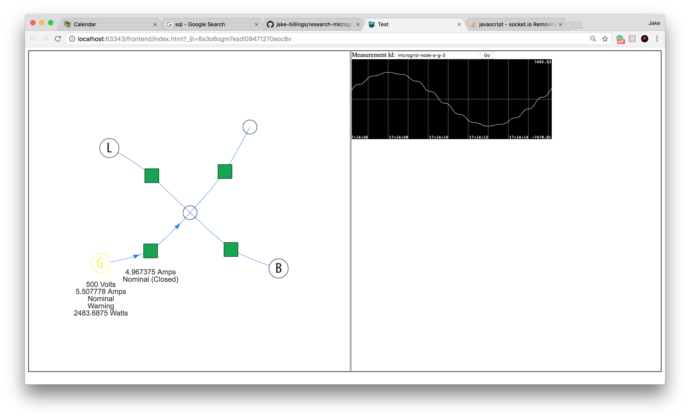

This repository contains code written for Dr. Park's microgrid research at University of Colorado Denver. The purpose is to implement a JADE agent that receives near real-time data from a distributed system of power-grid control/monitoring devices. It should store the data in SQL and send it to a GUI that maps the entire system.

I approached the problem as event-driven graph data. The power control/monitoring network is represented as a graph. The data is "pushed" to the "data agent" implemented in this repository by other agents.

Each data structure is abstracted in the "abs" package such that the code could theoretically be reused for an entirely different purpose. See `Graph` and `MicrogridGraph`.

## Contributors
Each class in this repository is assigned a "primary" author via the `@author` annotation in the class documentation. This primary author should have his/her first and last name listed in the class documentation first. The primary author should be the "person to ask" about the class. If you have questions about a class, this is the person to contact. Other contributors should be listed later in the author list. Contributors should leave contact information here in the README so that future contributors can find it.

|Name          | Primary Contribution                                 | Contact Information |
|--------------|------------------------------------------------------|---------------------|
|Amine Sasse   | `comporthandler` package                             |                     |
|Jake Billings | `agents,core,data,live,message,persistence` packages | [jake.billings@ucdenver.edu](mailto:jake.billings@ucdenver.edu), [billij@rpi.edu](billij@rpi.edu), [jake@jakebillings.com](jake@jakebillings.com) |

## Architecture
### Data Flow
1. Measured by Sender Agent, which interfaces with control hardware

1. Sent via JADE INFORM to Receiver Agent
1. State stored in Receiver agent
1. Ticker event sends state from Receiver Agent to Frontend Client via Socket.io

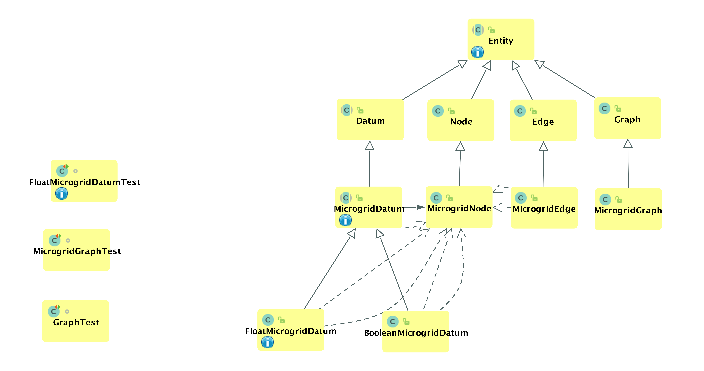
See `docs/Spec.docx` for more documentation/explanation of the communication protocol. It is important to understand the architecture before working on this repository.

Data is represented as Plain Old Java Objects (POJO) and sents as externalized bytes (using interface `Externalizable` stored in JADE ACLMessages).


### Implementation
Each level of the data flow runs separately. Somewhere, in another repository, there is code that runs on the hardware controller. It sends data via Serial. The agent `MicrogridControllerSenderAgent` uses the package `comporthandler2` to read this data from serial, convert it to a Java object, externalize it, and send via a JADE message to the `MicrogridReceiverAgent`. The receiver agent reads the object and updates its internal state map of the power grid. Every second, the receiver agent sends its grid state via Socket.IO to the browser. The browser uses Javascript and the Library `Vis.js` to render the power grid in a current state.

Thus, to run the full system, you need a hardware controller, a sender PC, and a receiver PC.
#### Steps to Run (some may be omitted if using dummies for testing)
1. For each PC, follow the installation instructions below.
1. Run `MicrogridReceiverAgent` on a dedicated receiver PC.
1. Open `src/resources/frontend/index.html` on the receiver PC.
2. Update `MicrogridControllerSenderAgent` to point its AID at the dedicated receiver PC.
3. Run the hardware controller, and connect it to the dedicated sender PC.
4. Ensure that `MicrogridControllerSenderAgent` is reading from the correct comport associated with the controller.
5. Start `MicrogridControllerSenderAgent` on the sender PC.
6. Assuming there are no errors, within 30 seconds, data will appear in the browser on the reciever PC.

Many dummy classes are included so that this system can be tested on a single PC. Dummy sender agents send dummy data so that we can test without a real controller or separate sender pc.

## Data Analysis
If you use the `DataLoggingReceiverAgent`, all data received by the system will be stored in your local SQL database by the Hibernate JPA implementation. Data can be viewed, processed, filtered, and analyzed using Structured Query Language (SQL). I recommend reading an online tutorial on SQL before attempting to use it to analyze this data.

First, you need an SQL client. There is a command line client built into MySQL. Popular clients include: Microsoft Access, MySQLWorkbench, and DataGrip. I will be using DataGrip since it has an interface similar to that of IntelliJ.

1. Connect to the local MySQL instance

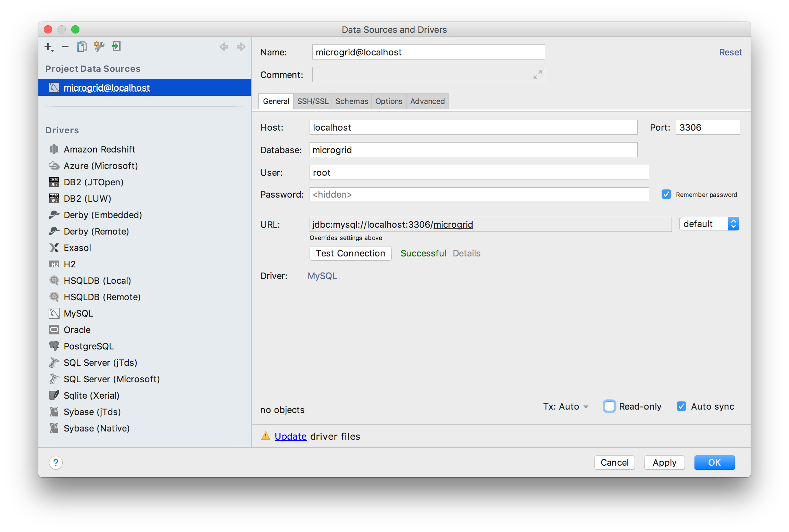

2. Open the correct table for the data you want
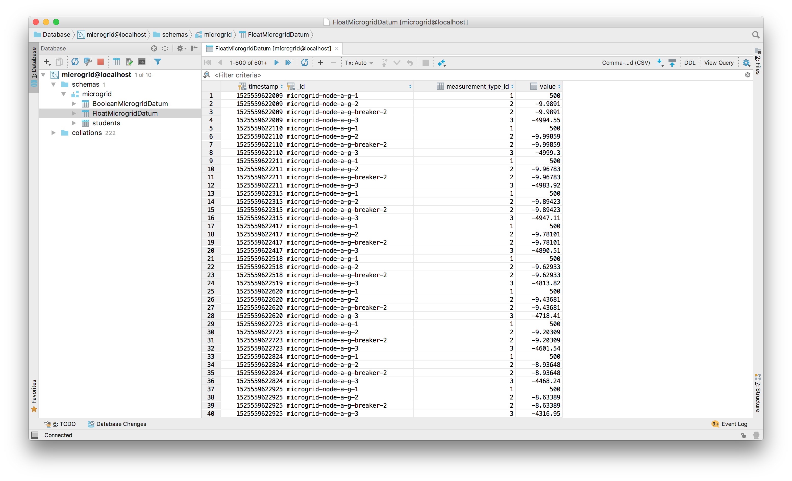

4. Open the console and build your SQL query; here's a template for selecting a single measurement at a single node:
```sql
SELECT timestamp,value
FROM microgrid.FloatMicrogridDatum
WHERE _id="microgrid-node-a-g-3"
ORDER BY timestamp ASC LIMIT 5000;
```

By convention, measurement id's are in the format `{{node_id}}-{{measurement_type_id}}`.
See `FloatMicrogridMeasurementType.java` and `BooleanMicrogridMeasurementType.java` for measurement type ids. By convention, floating point id's are positive, and boolean id's are negative.

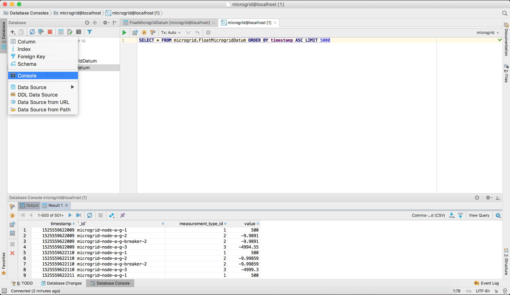

5. Export your data to CSV for analysis in external tools
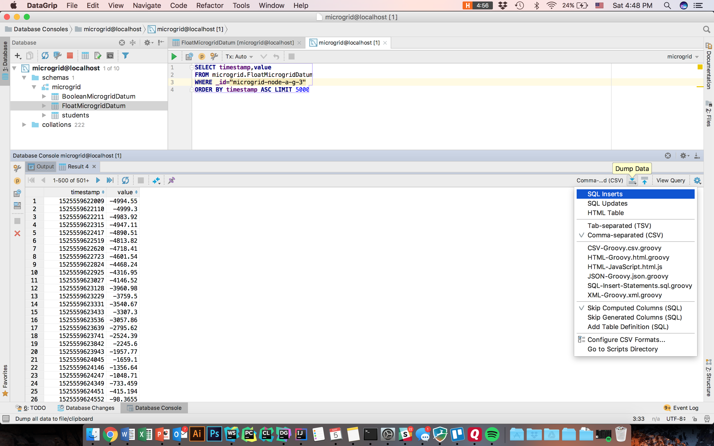

6. Open your CSV in an external tool and analyze it


All measurements have the field `timestamp`. This is field is the number of milliseconds since January 1st, 1970 12:00am when the measurement was recorded. Subtracting the first timestamp from the rest will normalize this field to the number of ms since data recording started.

## Prerequisites
1. You will need Administrator-level access to a computer
1. You will need to have cloned this git repository using `git clone`
1. You will need to have IntelliJ (or be able to translate my instructions from IntelliJ to whatever you're using)
1. You will need JDK 1.8 (Not JDK <1.8. NOT JDK >=1.9. You need exactly JDK1.8 (See "Issues" section)
1. You will need a database installed that is compatible with JDBC. The connector for MySQL is already in `pom.xml`, so I recommend MySQL.

## Setup Javascript Frontend
1. Install NodeJS

1. Check that NodeJS is actually installed `node --version`,  `npm --version`
1. Using the NodeJS package manager, install a better package manager, called Yarn. `npm i -g yarn`
1. Verify Yarn is installed using `yarn -v`
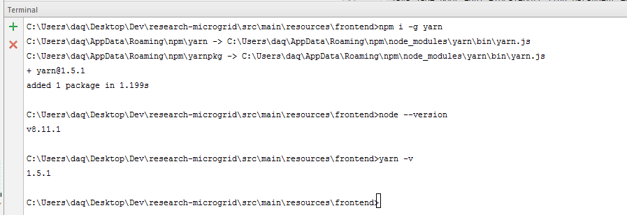
1. Move into the frontend project directory using `cd src/main/resources/frontend`
1. Install the frontend dependencies using `yarn install`


## Setup JADE/Java
1. Resolve dependencies using maven (use IntelliJ to do this) `mvn install` might also work
1a. Open the Maven Toolkit Window


1b. Open the Maven project by pressing the plus icon the selecting the pom.xml file
1c. Run Maven install to install all of the Java dependencies (JADE, Jackson, netty-socketio, etc...)
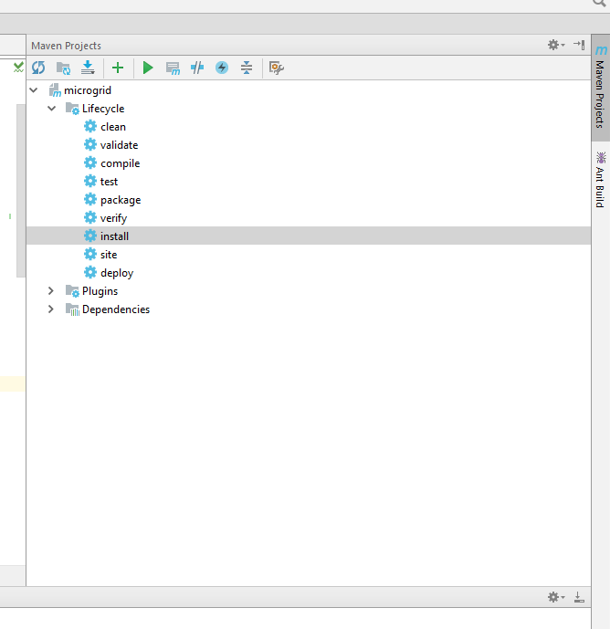

1d. Run the JUnit tests using Maven to make sure everything installed properly. You should see 0 failures. However, if you see "Failures: n" where n is some number there is a code issue (not a dependency issue). If you don't get test results, then there's probably an issue resolving dependencies or with maven configuration that must be addressed.
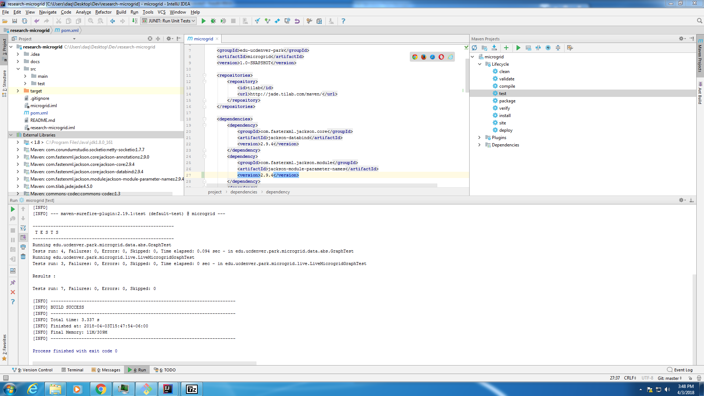

2. Run JUnit Tests (again but using IntelliJ test runner instead of Maven)
2a. Open run configurations


2b. Create a new run configuration for the JUnit tests
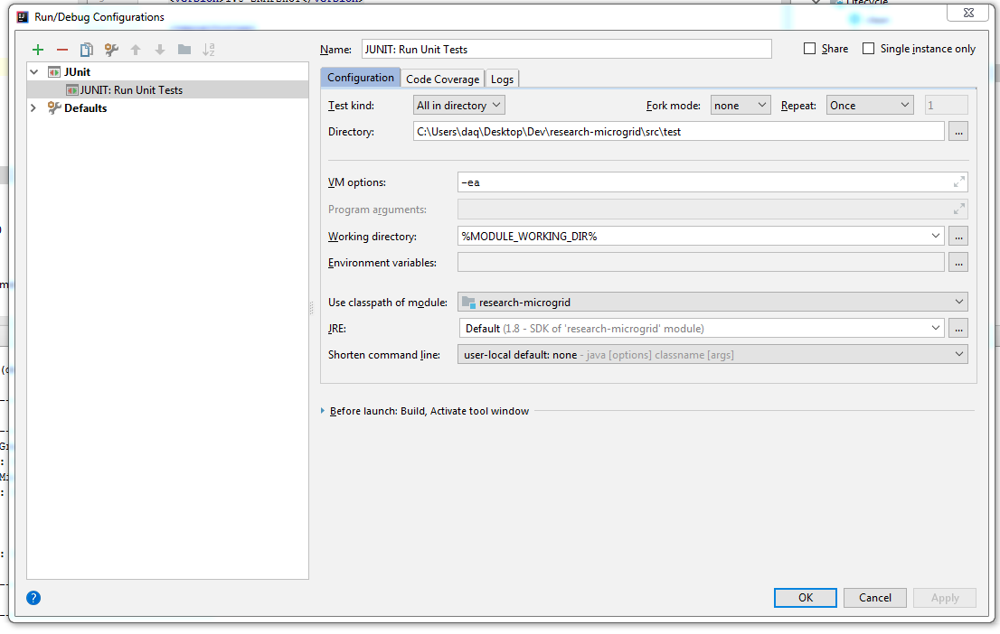

2c. Using the new run configuration, run the JUnit tests to make sure all the tested code works.


3. Create run configurations for the JADE agents
3a. Open run configurations


3b. Create a run configuration for the receiver agent
`java jade.Boot -gui -local-port 1100 ReceiverAgent:MicrogridReceiverAgent`


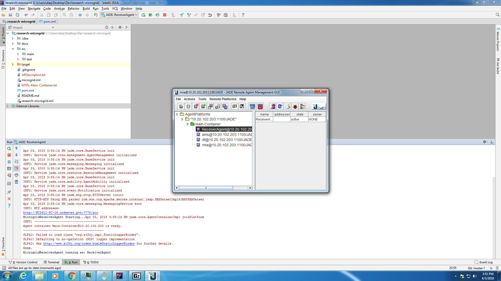

3c. Create a run configuration for the dummy sender agent (for testing purposes)
`java jade.Boot -gui -local-port 1100 DummySenderAgent:edu.ucdenver.park.microgrid.dummy.DummyMicrogridSenderAgent`


3d. Create a run configuration for the receiver agent AND dummy sender agent (for testing purposes)
`java jade.Boot -gui -local-port 1100 DummySenderAgent:edu.ucdenver.park.microgrid.dummy.DummyMicrogridSenderAgent`


3e. Run each agent and ensure that it displays appropriately in the JADE GUI

4. Database Setup (Required for Storing Data)
4a. Configure database address/credentials in config file. The info in `src/main/resources/hibernate.cfg.xml` must match your local db configuration. By default, we connect to a local MySQL server as root with no password.
4b. Ensure a database called `microgrid` exists in MySQL. To do this, run `mysql` in the terminal to enter the MySQL terminal. Then, run `create database microgrid;` in the MySQL terminal.

## Goals
The scrolling graph may eventually look like this oscilloscope.


The graph should handle large networks.


## Issues
1. Inherited issue from netty: we use a library to run a socket.io connection to a web browser. This library relies on netty. In Java 9, the keyword "native" is reserved. This breaks behavior in netty. Until netty is fixed, we must use JDK 1.8 instead of 1.9.
2. McAffee Firewall blocks JADE by default. I encountered this issue in the lab. Somebody installed McAffee security software on the lab computer. None of my JADE messages were getting through, and code changes didn't help. I saw connection timeout errors. Disabling the McAffee firewall fixed the issue.